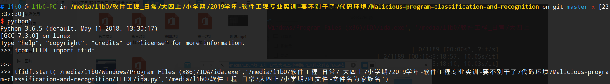

# Malicious-program-classification-and-recognition

## 1. 前言

本插件实现了基于word2vec和TF-IDF算法的恶意程序分类识别。

## 2. 依赖  

语言：Python3

系统：Windows & Linux

软件：IDA Pro & idapython(windows)， viper(linux)

## 3. 使用说明

### 3.1 训练模型

在windows系统下准备好恶意程序的训练集和测试集。

训练集

 

测试集


#### 3.1.1 word2vec预处理 - 反汇编

在文件夹`word2vec`同层目录下打开命令行，例子如下


当执行结束后，脚本会在恶意样本文件夹同层目录下生成一个名为`asm`的文件夹，存储恶意样本生成的汇编代码，一个名为`ans`的文件夹，存储asm文件转化的由汇编指令组成的语句文件，以及一个文件`top100.txt`，存有按出现次数从多到少排序的汇编指令列表。

```shell
# l1b0 @ l1b0-PC in /media/l1b0/软件工程_日常/大四上/小学期 [13:51:53] 
$ ls
ans
asm
top100.txt
PE文件-文件名为家族名
```

#### 3.1.2 TF-IDF预处理

 在文件夹`TF-IDF`同层目录下打开命令行，例子如下



执行结束后，脚本会在恶意样本文件夹同层目录下生成一个名为`api`的文件夹，存储恶意样本中提取的api，一个名为`functimes`的文件夹，存储样本中的api向量，以及一个名为`topapi.txt`的文件，存储关键程度高的api名字。

```shell
# l1b0 @ l1b0-PC in /media/l1b0/软件工程_日常/大四上/小学期 [13:51:53] 
$ ls
api
functimes
topapi.txt
PE文件-文件名为家族名
```

#### 3.1.3 模型训练

将`viper-plugin`文件夹里的`mcrtools`文件夹及`mcr.py`放在`viper/viper/modules`路径下。

在路径`/viper`下执行`sudo pip3 install .`更新模块。

执行下图命令开始模型的训练，参数一代表word2vec方法生成的语句文件，参数二代表TF-IDF方法生成的api向量文件，二者缺一不可。


训练完成后会在`ans`同目录下生成一个`model`文件夹，里面存储了训练产生的模型，用于后续预测样本。


### 3.2 样本分类识别

在文件夹`word2vec`同层目录下打开命令行，例子如下


## 1. How to use it

### 1.1 prepare your malicious program 

```powershell
PS F:\大四上\小学期\test> ls


    目录: F:\大四上\小学期\test


Mode                LastWriteTime         Length Name
----                -------------         ------ ----
d-----         2019/9/4     10:22                malicious


PS F:\大四上\小学期\test> cd .\malicious\
PS F:\大四上\小学期\test\malicious> ls


    目录: F:\大四上\小学期\test\malicious


Mode                LastWriteTime         Length Name
----                -------------         ------ ----
d-----         2019/9/4     10:49                backdoor.farfli
d-----         2019/9/4     10:21                rootkit.heur
d-----         2019/9/4     10:21                trojan.downloader
d-----         2019/9/4     10:22                trojan.generic
d-----         2019/9/4     10:22                trojan.pws
d-----         2019/9/4     10:23                variant.graftor
```

### 1.2 import maliciousClassify module

```python3
>>> from maliciousClassify import maliciousClassify as mc
>>> from maliciousClassify import batchprocess as bp
>>> from maliciousClassify import pre
>>> from maliciousClassify import count
```
#### maliciousClassify

* Integrate batchprocess， pre and count module

> mc.start(ida_path, malicious_parent_path)

```python3
>>> from maliciousClassify import maliciousClassify as mc
>>> mc.start('C:/Program Files (x86)/IDA/ida.exe','F:/大四上/小学期/test/malicious')
```

#### batchprocess

* Disassemble a batch of executable files

> bp.start(ida_path, malicious_parent_path)

```python3
>>> from maliciousClassify import batchprocess as bp
>>> bp.start('C:/Program Files (x86)/IDA/ida.exe','F:/大四上/小学期/test/malicious')
```

```powershell
PS F:\大四上\小学期\test> ls


    目录: F:\大四上\小学期\test


Mode                LastWriteTime         Length Name
----                -------------         ------ ----
d-----         2019/9/4     10:27                asm
d-----         2019/9/4     10:22                malicious
```

#### pre

* transfer the asm file to word file

> pre.start(asm_parent_path)

```python3
>>> from maliciousClassify import pre
>>> pre.start('F:/大四上/小学期/test/asm')
```

```powershell
PS F:\大四上\小学期\test> ls


    目录: F:\大四上\小学期\test


Mode                LastWriteTime         Length Name
----                -------------         ------ ----
d-----         2019/9/4     10:39                ans
d-----         2019/9/4     10:27                asm
d-----         2019/9/4     10:22                malicious
```

#### count

* count the number of assembly instructions in asm files and sort it

> count.start(ans_parent_path)

```python3
>>> from maliciousClassify import count
>>> count.start('F:/大四上/小学期/test/ans')
```

```powershell
PS F:\大四上\小学期\test> ls


    目录: F:\大四上\小学期\test


Mode                LastWriteTime         Length Name
----                -------------         ------ ----
d-----         2019/9/4     10:39                ans
d-----         2019/9/4     10:27                asm
d-----         2019/9/4     10:22                malicious
-a----         2019/9/4     10:43           1226 count.txt

PS F:\大四上\小学期\test> cat .\count.txt
[[15260, "push"], [11175, "mov"], [10730, "pop"], [4529, "inc"], [4144, "dec"], [3540, ","], [2558, "call"], [2310, "jmp"], [1413, "lea"], [1359, "retn"], [1061, "."], [974, "add"], [932, "sub"], [912, "cmp"], [814, "test"], [807, "xor"], [724, "jz"], [600, "and"], [527, "jnz"], [290, "adc"], [281, "stosd"], [245, "or"], [237, "sbb"], [212, "leave"], [192, "rep"], [141, "jl"], [133, "jbe"], [112, "ja"], [106, "nop"], [99, "movzx"], [94, "jle"], [92, "jg"], [82, "jb"], [78, "stosw"], [77, "popa"], [74, "pusha"], [74, "jno"], [70, "jo"], [66, "jge"], [49, "aaa"], [46, "lds"], [40, "shr"], [36, "scasb"], [33, "repne"], [30, "stosb"], [29, "jnb"], [28, "not"], [26, "js"], [25, "shl"], [24, "xchg"], [19, "movsb"], [19, "in"], [15, "retf"], [14, "jns"], [14, "cli"], [12, "cld"], [11, "setnl"], [11, "imul"], [10, "movsx"], [10, "iret"], [9, "cmpsb"], [8, "into"], [8, "aas"], [7, "out"], [7, "lodsb"], [6, "wait"], [6, "std"], [6, "rcr"], [5, "xlat"], [5, "sahf"], [5, "lahf"], [5, "fld"], [5, "daa"], [5, "clc"], [5, "aam"], [4, "sti"], [4, "stc"], [4, "loop"], [4, "fadd"], [4, "aad"], [3, "setnz"], [3, "sal"], [3, "ror"], [3, "loope"], [2, "rol"], [2, "loopne"], [2, "lock"], [2, "idiv"], [2, "hlt"], [2, "fmul"], [1, "setnle"], [1, "neg"], [1, "movsw"], [1, "jp"], [1, "jnp"], [1, "jecxz"], [1, "int"], [1, "fsub"], [1, "fldenv"], [1, "fisub"], [1, "fidiv"], [1, "ficomp"], [1, "ficom"], [1, "fcom"], [1, "fcmovnb"], [1, "cmc"]]
```

### 1.3 import TFIDF module

```python3
from TFIDF import tfidf
from TFIDF import getApiList
from TFIDF import calcTF
```

#### tfidf

```python3
from TFIDF import tfidf
tfidf.start('C:/Program Files (x86)/IDA/ida.exe','F:/大四上/小学期/test/malicious')
```

#### getApiList

```python3
from TFIDF import getApiList
getApiList.start('C:/Program Files (x86)/IDA/ida.exe','F:/大四上/小学期/test/malicious')
```

#### calcTF

```python3
from TFIDF import calcTF
calcTF.start('F:/大四上/小学期/test/api')
```

