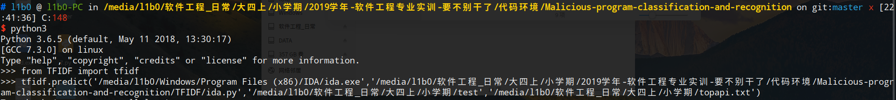

# Malicious-program-classification-and-recognition

## 0. 文件说明

`word2vec`和`TF-IDF`文件夹均封装成python模块。

`viper-plugin`内有`mcrtools`文件夹和`mcr.py`，将这两个文件放入`viper/viper/modules`即可。

## 1. 前言

本插件实现了基于word2vec和TF-IDF算法的恶意程序分类识别。

## 2. 依赖  

语言：Python3

系统：Windows & Linux

软件：IDA Pro & idapython(windows)， viper(linux)

## 3. 使用说明

### 3.1 训练模型

在windows系统下准备好恶意程序的训练集和测试集。

训练集

 

测试集


#### 3.1.1 word2vec预处理 - 反汇编

在文件夹`word2vec`同层目录下打开命令行，例子如下


当执行结束后，脚本会在恶意样本文件夹同层目录下生成一个名为`asm`的文件夹，存储恶意样本生成的汇编代码，一个名为`ans`的文件夹，存储asm文件转化的由汇编指令组成的语句文件，以及一个文件`top100.txt`，存有按出现次数从多到少排序的汇编指令列表。

```shell
# l1b0 @ l1b0-PC in /media/l1b0/软件工程_日常/大四上/小学期 [13:51:53] 
$ ls
ans
asm
top100.txt
PE文件-文件名为家族名
```

#### 3.1.2 TF-IDF预处理

 在文件夹`TF-IDF`同层目录下打开命令行，例子如下


执行结束后，脚本会在恶意样本文件夹同层目录下生成一个名为`api`的文件夹，存储恶意样本中提取的api，一个名为`functimes`的文件夹，存储样本中的api向量，以及一个名为`topapi.txt`的文件，存储关键程度高的api名字。

```shell
# l1b0 @ l1b0-PC in /media/l1b0/软件工程_日常/大四上/小学期 [13:51:53] 
$ ls
api
functimes
topapi.txt
PE文件-文件名为家族名
```

#### 3.1.3 模型训练

将`viper-plugin`文件夹里的`mcrtools`文件夹及`mcr.py`放在`viper/viper/modules`路径下。

在路径`/viper`下执行`sudo pip3 install .`更新模块。

执行下图命令开始模型的训练，参数一代表word2vec方法生成的语句文件，参数二代表TF-IDF方法生成的api向量文件，二者缺一不可。


训练完成后会在`ans`同目录下生成一个`model`文件夹，里面存储了训练产生的模型，用于后续预测样本。


### 3.2 样本分类识别

#### 3.2.1 word2vec预处理 - 反汇编

在文件夹`word2vec`同层目录下打开命令行，例子如下


#### 3.2.2 TF-IDF预处理

在文件夹`TF-IDF`同层目录下打开命令行，例子如下



#### 3.2.3 预测


结束后会在`ans`同目录下生成一个`answer.txt`的文件，存有每个样本的预测结果。

